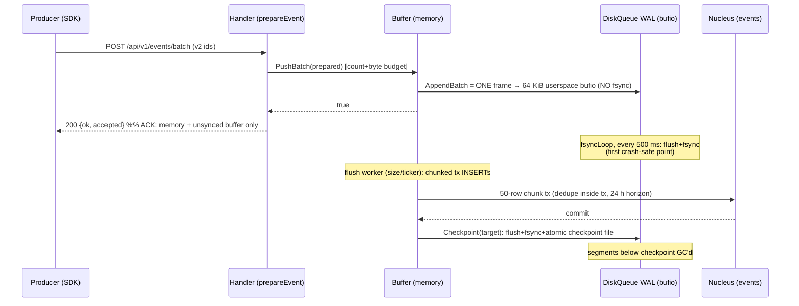
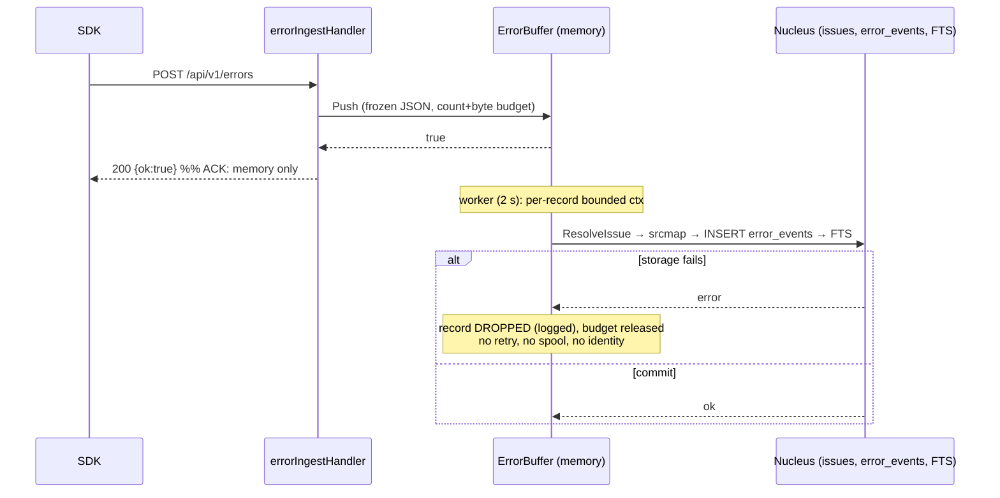
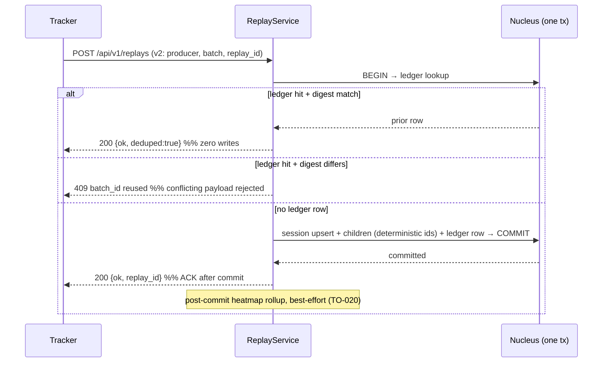

# Durable Ingest ADR (O01)

Status: ACCEPTED (pre-implementation contract) — 2026-09-22. Programme
workstream O01, "Durable acceptance and idempotent processing for every
signal" (P0). This record is the pre-edit obligation in the O03 pattern:
it inventories what each ingest signal does TODAY, pins the current
semantics with executable tests, and locks the destination contract
BEFORE any implementation slice changes ingest behavior. **No production
ingest code changed in this slice.** The one production-adjacent change
is a truth-labeling fix to README.md, which overclaimed the WAL
(see §3.1).

Executable oracle (pins CURRENT semantics; every test names the
destination-contract line it guards):

- `internal/ingest/o01_pin_test.go` — WAL periodic-sync loss window,
  crash-equivalent restart recovery, buffer ack ordering.
- `internal/errors/o01_pin_test.go` — error-path memory-only ack and
  drop-on-flush-failure disposition (Nucleus-gated).
- Already-pinned semantics this slice verified rather than re-pinned:
  high-water breach drop (`TestDiskQueue_HighWaterBreachDropsOldestSegmentLoudly`),
  torn-tail repair, corrupt-complete-record refusal, checkpoint bounds/
  monotonicity, replay dedupe of committed events
  (`TestReplayDedup_DropsAlreadyCommitted`), flush dedupe
  (`TestFlushDuplicateProducerIDsInsertedOnce`), replay batch ledger
  (`internal/replays/retries_integration_test.go`).

Rule carried from O03: a future behavior change must update the pinning
test in the SAME change, deliberately, and record the era here.

**ERA 2 — 2026-09-22, implementation slice 1 landed (events group
commit).** Durable mode is now the default for the events signal: a 200
means the batch's WAL frame is fsynced (group commit, §5.1), the disk
high-water refuses admission instead of deleting (§5.2), and
`OBSERVE_WAL_LOSSY=true` is the explicit opt-in that restores the era-1
semantics with visible counters (§5.3). Pin updates made in the same
change: `internal/ingest/o01_pin_test.go` (all three era-1 pins —
ack-ordering flipped to waits-for-group-commit, the async-append pin
renamed to its lossy-mode role, the periodic-sync recovery pin kept with
its backstop framing) and
`TestDiskQueue_HighWaterBreachDropsOldestSegmentLoudly` (delete-at-breach
now pinned under explicit lossy mode). New era-2 pins:
`internal/ingest/o01_group_commit_test.go`. The §3 events row below is
the era-2 reality; §1.1's hop table remains the era-1 record.

---

## 1. Inventory — every ingest signal, end to end

Verified against the tree at `4697beb` (branch tip, clean working
tree; the handoff's `fd2986c` is an unbranched amended variant of the
same commit).

### 1.1 Analytics events — `POST /api/v1/events`, `POST /api/v1/events/batch`

| Hop | Where | Mechanics | Durability at this hop |
| --- | --- | --- | --- |
| Entry | `cmd/observe/main.go:734-741` (ingestGroup: API-key auth → per-site rate limit → 2 MiB body limit) | typed neutron handler | — |
| Parse+prepare | `internal/ingest/handler.go:192` (single), `:597` (batch); `prepareEvent` `handler.go:214` is side-effect-free | 100 events/batch cap, 64 KiB/event, bot drop | — |
| Admission | `Buffer.PushBatch` `internal/ingest/buffer.go:368` — one lock: count cap, byte budget (256 MiB default), **WAL append**, memory append | whole batch or nothing (AUD-010) | **WAL frame written to a 64 KiB userspace bufio — NOT fsynced, not even in the OS page cache** (`queue.go:532`) |
| **ACK** | `handler.go:658` returns `{ok, accepted, rejected}` → HTTP 200 | sent here | **memory + unsynced WAL buffer only** |
| Periodic sync | `DiskQueue.fsyncLoop` `queue.go:983`, interval **500 ms** in prod (`main.go:298`) | flush bufio + fsync | first point any admitted byte is crash-safe (SIGKILL-safe; still not power-loss-proven on all filesystems) |
| Flush to DB | `Buffer.Flush` `buffer.go:437` (flushSize wakeup or ticker; serialized by flushMu) → `insertBatch` `buffer.go:654`: 50-row chunks, one tx per chunk, events+events_recent, flush-time dedupe inside the chunk tx (`filterUncommitted` `buffer.go:621`) | single-flusher invariant; failed flush requeues the uncommitted tail | SQL commit |
| Checkpoint | `queue.Checkpoint(target)` `buffer.go:488` → `queue.go:711` (flush+fsync+atomic checkpoint file under mu) | monotonic; segment GC below it | replay boundary advances |
| Crash recovery | `AttachQueue` `buffer.go:153` at boot: `StreamPending` → write-through commit in 500-event chunks (dedupe inside each chunk tx), checkpoint once at end | bounded memory (TO-014) | — |

Dedupe identity: producer `event_id`, **site-scoped** (TO-018), wire v2.
Two layers: in-process admission cache `(site, producer, batch)` +
identity digest, TTL 10 min, bounded 16384 (`handler.go:589-592`); and
the durable flush-time existence check with a **24 h horizon**
(`flushDedupeHorizon` `buffer.go:610`), fail-open. v1 payloads (no ids)
have no dedupe.

Loss/duplication windows: crash between ACK and first periodic sync
loses up to one 500 ms interval (plus anything unflushed in bufio);
disk high-water breach DELETES UNCHECKPOINTED segments to keep admitting
(`enforceCapLocked` `queue.go:617`, counters + loud log + `/healthz`);
a corrupt complete WAL frame at open makes replay an ERROR
(`queue.go:921`) → `AttachQueue` fails → process runs MEMORY-ONLY
(healthz `memory-only`; fatal only under `OBSERVE_REQUIRE_WAL`). A
producer retry older than the 24 h horizon (and past the admission
cache) double-counts. A failed WAL write latches the queue (F14) and
admission refuses rather than acking undurably — correct posture, kept.

### 1.2 Errors — `POST /api/v1/errors`

| Hop | Where | Mechanics | Durability |
| --- | --- | --- | --- |
| Entry | `main.go:744` → `errorIngestHandler` `main.go:2470` | key-bound site required (R04) | — |
| Admission | `ErrorBuffer.Push` `internal/errors/buffer.go:150` — frozen JSON snapshot; count 50000 + 64 MiB byte budget, 256 KiB/record (R13) | refuse → 429 | **memory only — no WAL, no spool** |
| **ACK** | `main.go:2491` `{ok:true}` | sent here | **memory only** |
| Flush | worker (2 s ticker / size wakeup), `buffer.go:194`: per-record bounded ctx (R14 contained) → `Service.IngestErrorEvent` `internal/errors/handler.go:139`: ResolveIssue (monotonic version) → optional srcmap → INSERT error_events → FTS index (non-fatal, logged) | one record per ctx | SQL commit |
| Failure disposition | `buffer.go:216-224` | **record dropped with a log line; nothing requeued, nothing retried** | acked-then-lost |

Dedupe identity: **none.** `error_id` is minted fresh per store call
(`handler.go:197` `genID()`); `ErrorInput` carries no producer identity.
The programme handoff's "errors have a stable producer event ID +
payload digest with an inbox" describes the DESTINATION contract, not
current code — the durable idempotent inbox is the deferred R14 half
(recorded in `AUDIT_OPEN.md` since round 4) and is §5.6 below. What
exists and is kept: issue-level grouping (grouphash) collapses duplicate
events into one issue, but per-event counts and first/last-seen still
double on retry.

Graceful Stop does a final flush — but a memory queue with a shutdown
flush is not durable acknowledgment: SIGKILL/power loss between ACK and
flush loses the record outright.

### 1.3 Logs — `POST /v1/logs` (OTLP proto/JSON; also the chunked batch API)

`internal/logs/otlp.go:126` handler (10 MiB decompressed cap, 415/413
conformance, 503 + Retry-After on storage failure) → `ingestExport`
`otlp.go:255` (splits to 200-record chunks) → `LogService.IngestLogs`
`internal/logs/logs.go:177`: pipeline rules per entry, then ONE batched
multi-row INSERT per 50-row chunk (`insertLogsBatch` `logs.go:289`).

- **ACK timing:** response is sent AFTER the synchronous insert attempt
  — a 200 means SQL commit happened. This is the honest synchronous
  shape (no async gap).
- **But:** chunks are autocommit; a failing chunk is skipped and later
  chunks still attempted; the committed rows are kept and the request
  still 503s. A retrying exporter resends the WHOLE batch → **the
  already-committed prefix is duplicated** (no producer identity; the
  O02 decision records that OTLP has no universal event id).
- Dedupe identity: none (`log_id` fresh `genID`). SSE live-tail
  publishes only committed rows.
- Crash windows: crash mid-request loses the uncommitted chunks only
  (client retry redoes them — plus duplicates any committed prefix);
  there is no server-side replay state.

### 1.4 Traces — `POST /v1/traces` (+ `/api/v1/v1/traces` sentry-shim alias)

`internal/tracing/otlp_http.go` → `IngestService.ingest`
`internal/tracing/ingest.go:68`: flatten → `insertSpans` `ingest.go:217`
(50-row chunks, autocommit, **stops at first failing chunk; earlier
chunks stay committed**) → response; then derived work in a DETACHED
goroutine (30 s ceiling): `writeRollups` (service_stats,
service_dependencies) + detector findings (performance_issues)
`ingest.go:99-106`.

- **ACK timing:** after synchronous span commit, BEFORE derived work.
- 503 + Retry-After on insert failure → exporter retry duplicates the
  committed prefix (spans table has no uniqueness on (trace_id, span_id)).
- Crash after ACK, before/ during the rollup goroutine: spans are
  durable, rollups/detector findings for them are **silently missing
  forever** (no outbox, no rebuild job; spans retention 14 d would
  allow a rebuild, none exists). This is the TO-020 derived-work class,
  consolidated into §5.7.

### 1.5 Metrics — `POST /v1/metrics`

`internal/metrics/otlp_http.go` → `Service.Ingest` `metrics.go:78` →
`insertMetricRows` `metrics.go:202` (same chunked-autocommit shape as
spans; stop at first failure). ACK after synchronous commit; 503 retry
duplicates committed prefix. No identity (append-only points; queries
aggregate raw points — duplicates skew sums/histograms). No derived
tables.

### 1.6 Session replay — `POST /api/v1/replays`

`replayIngestHandler` `main.go:4634` → `ReplayService.Ingest`
`internal/replays/replays.go:515`: striped lock → owner check → ONE
transaction: ledger lookup → session upsert → child INSERTs (v2:
deterministic child ids from (site, replay, producer, batch, index)) →
ledger row (event_count + sha256 digest) → COMMIT `replays.go:707`.
Response after commit.

- **ACK timing:** after commit — the strongest current path. Crash
  after commit + lost response → retry hits the ledger: same digest →
  `{ok, deduped:true}`, zero writes; different digest → **409
  `ErrBatchIDReuse`** (conflicting payload rejected). Crash before
  commit → clean rollback → retry reprocesses with identical child ids.
- This IS the inbox pattern the programme asks the other signals to
  grow: stable producer identity (producer_id, batch_id), payload
  digest, ledger committed atomically with application state.
- Post-commit heatmap rollups: best-effort, no outbox (TO-020) — a
  retry that would redo them is ledger-deduped away, so a heatmap
  failure permanently skips that batch's derived work.
- v1 batches (no identity): fresh ids, duplicates possible — kept
  deliberately for compatibility.
- **Ledger retention: none.** `replay_batches` has no retention policy
  (`internal/jobs/retention.go` `DefaultPolicies` does not list it) —
  the dedupe window is currently UNBOUNDED, which is an undocumented
  infinite-exactly-once promise in the other direction. See §5.8.

### 1.7 Experiment exposures/conversions — `POST /api/v1/experiments/expose|convert`

`main.go:762-769` → `RecordExposure`/`RecordConversion`
`internal/experiments/experiments.go:116/130`: synchronous single
autocommit INSERT; response after commit. No producer identity
(fresh `exposure_id`/`conversion_id`); a retried request appends a
duplicate row. Analysis is `COUNT(DISTINCT user_id)` for BOTH exposures
and conversions (`experiments.go:172-190`), so user-level results are
duplicate-tolerant; raw-row inflation is unbounded. Conversion needs a
prior exposure row (read-then-insert, no tx) — a lost exposure response
plus retry is harmless; a concurrent exposure+conversion race can drop
the conversion (accepted, low stakes, recorded here).

### 1.8 Derived jobs (none of which carry an outbox today)

| Job | Schedule | Commit relationship | Crash effect |
| --- | --- | --- | --- |
| Session/hourly/daily rollups | `jobs.Scheduler` periodic (`main.go:484-486`) | recomputes from raw `events` windows | a skipped run leaves the window unaggregated until the next run recomputes it (session rollup is window-scoped recompute — self-healing; verify per-window at implementation time) |
| Trace rollups + detectors | detached goroutine post-commit (`tracing/ingest.go:99`) | after span commit, before response? no — after response | permanently missing for committed spans (§1.4) |
| Replay heatmaps | post-commit best-effort (`replays/replays.go:711`) | after ledger commit | permanently skipped; retry deduped away (TO-020) |
| Alert evaluation | bgWorkers 30 s (`main.go:576`) | reads committed data | stateless rule eval; incident open is idempotent (EnsureOpen) |
| Webhook delivery | in-process queue, 4 workers, 1000 cap, drop-OLDEST loudly, 3 retries, stable delivery id (R22, `platform/webhooks.go:29-55`) | after alert fire | queue is memory-only → restart drops undelivered alerts (R22 durable half, §5.7) |
| Uptime/cron results | sync INSERT on probe/checkin (`monitoring/monitoring.go:262`) | response after commit | none beyond a lost probe row |
| Scheduled exports | bgWorkers 10 s (`main.go:609`) | run records are versioned rows | self-recording |

---

## 2. Acknowledgment / commit diagrams (current)

### 2.1 Analytics events — 200 precedes every durable hop



Crash points: (a) after ACK before periodic sync → **lose ≤500 ms of
acked events**; (b) after sync before flush → WAL replay on restart
recovers; (c) after SQL commit before checkpoint → replay + flush dedupe
drops the committed ids (pinned); (d) high-water breach at any roll →
**uncheckpointed segment deleted** to keep admitting (pinned) → those
acked events lose their crash-recovery copy while still memory-resident.

### 2.2 Errors — 200 precedes ALL storage; failure drops after ack



### 2.3 Logs / traces / metrics (OTLP) — 200 after sync SQL, but the 503 retry path duplicates

```mermaid
sequenceDiagram
    participant X as OTLP exporter
    participant O as OTLP handler
    participant D as Nucleus (logs/spans/metric_points)
    X->>O: POST /v1/{signal} (proto/json, gzip)
    O->>D: chunked autocommit INSERTs (50 rows)
    Note over D: chunk k fails → chunks < k already committed<br/>logs: skip k, continue k+1; spans/metrics: stop
    alt all committed
        D-->>O: ok
        O-->>X: 200 (zero-value ExportResponse / partialSuccess)
    else any failure
        O-->>X: 503 + Retry-After: 5
        X->>O: retry WHOLE batch
        Note over D: committed prefix re-inserted → duplicates<br/>(no producer identity — O02 documented limit)
    end
    Note over O,D: traces only: detached rollup+detector goroutine AFTER response<br/>(crash ⇒ derived work lost, no outbox)
```

### 2.4 Replays — the reference durable shape



### 2.5 Exposures/conversions

Synchronous autocommit INSERT, response after commit, no identity —
retry appends a duplicate row; DISTINCT-user analysis tolerates it.

---

## 3. Current guarantees — honest table

| Signal | ACK sent after | Bytes durably safe after | Server retry safety | Identity | Crash-between-ACK-and-durable loses |
| --- | --- | --- | --- | --- | --- |
| events (single/batch) — ERA 2 (2026-09-22, slice 1) | group-commit fsync of the batch's WAL frame (default; lossy mode: memory admission only) | the ack's own fsync (≤ group-commit window + one fsync); lossy mode: periodic fsync (≤500 ms) | dedupe ≤24 h horizon (durable), 10 min cache; durability refusals are 503 + Retry-After | site-scoped event_id (v2) | durable: nothing on 200 — the disk high-water REFUSES (counted) instead of deleting; lossy: ≤1 sync interval of acked events (declared budget) |
| errors | memory admission | SQL commit at flush (2 s cadence) | none — retry double-counts issues/counts | none | everything unflushed; storage failure drops acked records |
| logs | sync SQL commit | same moment | 503 retry duplicates committed prefix | none (O02) | nothing on 200; duplication on 503+retry |
| traces | sync span commit | same moment | 503 retry duplicates committed prefix; rollups not retryable at all | none (O02) | spans safe on 200; derived rollups/detectors can be silently missing |
| metrics | sync SQL commit | same moment | 503 retry duplicates committed prefix | none (O02) | nothing on 200; duplication on 503+retry |
| replays (v2) | SQL COMMIT (ledger+children+session, one tx) | same moment | ledger dedupe; digest conflict 409 | producer+batch+digest | nothing; heatmap derived work best-effort |
| replays (v1) | SQL COMMIT | same moment | none | none | nothing, but retries duplicate |
| exposures/conversions | sync SQL commit | same moment | analysis is DISTINCT-user (duplicate rows tolerated) | none | nothing on 200; raw rows duplicate on retry |

Availability posture under pressure — ERA 2 (2026-09-22, slice 1):
events REFUSE at the disk high-water with a retryable 503 + Retry-After
(durable default, counted — never delete-to-admit);
`OBSERVE_WAL_LOSSY=true` restores keep-admitting-by-deleting explicitly
(counted, loss budget visible at /healthz); errors refuse (429); OTLP
signals 503; replays 503 (DB is the store).

### 3.1 Doc overclaims fixed in this slice

README.md claimed "accepted events are mirrored to the queue; graceful
shutdown fsyncs the queue; crash recovery replays records since the last
checkpoint" — true only up to the periodic-sync window and the
high-water's lossy default. Truth-labeled to name both and cite this
ADR (the queue's own package comment `queue.go:19-49` was already
honest). No other doc overclaims were found: `/healthz`'s
`"durability":"wal"` label names the MODE (WAL attached), and its
degraded states are separate values; keep that reading — §5.10 makes
the label load-bearing.

---

## 4. Fault model — what must reconcile, today's answer

| Fault | Events | Errors | Logs/Traces/Metrics | Replays v2 |
| --- | --- | --- | --- | --- |
| crash after ACK, before durable | lose ≤500 ms | lose all unflushed | n/a (ack IS commit) | n/a |
| crash after apply, before checkpoint | replay + flush dedupe drops (pinned) | n/a | n/a | n/a (no second stage) |
| lost response (commit succeeded) | retry: cache or 24 h filter dedupes | retry duplicates | retry duplicates prefix | ledger dedupes / 409 |
| concurrent duplicate | flush-time filter (single flusher) | duplicates | duplicates | striped lock + in-tx ledger |
| storage unavailable at flush | requeue tail, admission keeps flowing until byte budget → 429; WAL latches on WRITE failure (F14) | acked records dropped (logged) | 503 + Retry-After | 503 (tx rollback) |
| full disk (WAL) | high-water deletes uncheckpointed segment (lossy default, counted); WAL write failure latches + refuses admission | 429 at budget; handler errors at flush drop | 503 | 503 |
| corrupted/ truncated WAL tail | torn tail truncated at open (pinned); complete-but-corrupt frame = replay ERROR → attach fails → memory-only unless OBSERVE_REQUIRE_WAL | n/a | n/a | n/a |
| poison record at SQL layer | chunk tx fails → requeue → bounded retry cadence (F10) → buffer fills → 429 backpressure; no quarantine, no diversion | record dropped after ack | failing chunk skipped (logs) or aborts (spans/metrics); NO diversion | tx rollback, retried forever by client (digest stable → same failure) |

---

## 5. Destination contract (per the programme's recommended default)

Implementation slices change behavior ONLY against this section, each
updating its pinning test in the same change.

### 5.1 Durable mode = bounded group commit before acknowledgment (events)

**IMPLEMENTED 2026-09-22 (slice 1).** Shape as shipped: `AppendBatch`
enqueues the frame (async, unchanged); `WaitCommit(offset)` blocks the
request until ONE shared flush+fsync covering its frame completes. A
dedicated committer goroutine holds the commit window open for at most
`OBSERVE_WAL_GROUP_COMMIT_MAX_DELAY` (default 25 ms) from the FIRST
outstanding waiter — WITHOUT holding the queue mutex, so concurrent
requests keep joining the group — or fires early at 1 MiB of unsynced
bytes; appends arriving while the fsync runs queue on the mutex and join
the NEXT group. `Buffer.PushBatch` appends under its lock, releases it,
then waits (waiting under the buffer lock would serialize requests
behind each window instead of sharing it). Group-commit flush/sync
failures latch the queue F14-style. Graceful-close semantics unchanged.
The 500 ms periodic loop remains as a backstop, not the durability
boundary. fsync on the OBSERVE HOST is the boundary (client fsync was
never claimed). Frames are newline-delimited JSON with identity; the
torn-tail repair stays the integrity check. Coverage may also arrive via
Checkpoint/roll/periodic sync (waiters resolve against the
`syncedOffset` watermark).

### 5.2 Disk-budget admission refusal replaces deletion (durable mode)

**IMPLEMENTED 2026-09-22 (slice 1).** At roll time in durable mode the
queue first reclaims acknowledged segments, then — if the admission
would still breach `OBSERVE_WAL_MAX_TOTAL_BYTES` (default 512 MiB;
eight default 64 MiB segments, sized so a healthy flush keeps the WAL
well under the cap while a stalled database has a long durable runway)
— refuses it with `ErrWALHighWaterRefused` (503 + Retry-After via the
ingest group's middleware, counted at `wal.refused_high_water`), an
uncheckpointed segment is NEVER deleted to keep acknowledging traffic.
The refusal is retryable, not latched: admission resumes once the
checkpoint advances. The delete-oldest behavior survives only in
EXPLICIT lossy mode.

### 5.3 Explicit lossy mode with visible counters

**IMPLEMENTED 2026-09-22 (slice 1).** `OBSERVE_WAL_LOSSY=true`
(per-deployment opt-in, never default): era-1 semantics — periodic sync
only (WaitCommit returns immediately, acks carry no fsync), high-water
deletes uncheckpointed segments — with the existing counters
(`dropped_unacked_segments/bytes`) plus the accepted-vs-durable gap at
`/healthz` (`events.accepted` vs `events.durably_acked`, with
`wal.unsynced_events` as the live potentially-lost gauge). Declared
loss budget: up to one sync interval (500 ms) of acked events, plus any
events whose segment a high-water breach drops (headroom above the
budget is the operator's cap). The README documents the mode and its
budget. Default when unset: durable mode per 5.1/5.2.

### 5.4 Bounded retryable backpressure everywhere

Every refusal on the durability path is 503/429 + `Retry-After` with a
BOUNDED queue behind it (events: existing byte budget; errors: existing
budget — both already refuse rather than drop at admission). The errors
pipeline's post-ack drop (§1.2) is the violation: in durable mode a
flush failure must stop acking (admission closes / healthz degrades)
rather than silently drop acked records — the analytics buffer's F14
latch is the model.

### 5.5 Quotas (count/byte/disk) — design points

Per signal: events (count `BufferSize`, bytes `OBSERVE_MAX_BUFFERED_BYTES`
256 MiB, disk segment 64 MiB + total 512 MiB); errors (count 50000,
bytes 64 MiB, per-record 256 KiB — all memory); OTLP (request body 2 MiB
/ 10 MiB decompressed, batch 200 logs / 100 events); replays (body
limit; chunking deferred with F39). Additions for the slices: a
per-signal QUARANTINE byte budget (below), and a per-site fair-share of
the admission budgets so one site cannot monopolize the WAL (design
point only — the per-site rate limiter already bounds request rate).

### 5.6 Error inbox (stable producer identity + digest + atomic ledger)

Mirror the replay ledger exactly: SDK sends `event_id` (producer-stable,
validated alphabet) + the server derives `sha256` of the canonical
payload; `error_inbox` row (site, producer_id, event_id, digest)
commits in the SAME transaction as issue resolution + error_events
insert; duplicate + same digest → `{ok, deduped:true}` zero writes;
duplicate + different digest → 409 (conflicting id); retry after ledger
retention expiry → processed as new (documented, §5.8). Retries may
safely return success exactly when the ledger row exists with a matching
digest. This closes R14's durable half.

### 5.7 Derived-work outbox (rollups, detectors, heatmaps, webhooks)

`derived_work` rows committed in the originating transaction (trace
ingest, replay ingest, alert fire) with a work type + bounded payload
reference; an idempotent worker drains with retry/backoff; a bounded
dead-letter (quarantine) for work whose application keeps failing.
Subsumes TO-020 (heatmap outbox), R22's durable half (webhook
deliveries), and the trace rollup goroutine. The scheduled analytics
rollups stay periodic-recompute (self-healing) and are NOT outboxed.

### 5.8 Dedupe retention windows — finite, documented, no silent infinite exactly-once

- events: admission cache 10 min (in-process) + flush filter **24 h**
  horizon (`flushDedupeHorizon`). A retry older than 24 h (post-cache,
  post-restart) is PROCESSED AS NEW and double-counts. Documented at the
  constant and in the SDK retry docs; producers' bounded retention
  (200 events, 5 attempts, 60 s cap) keeps real clients inside it.
- replays: `replay_batches` ledger retention currently UNBOUNDED — add
  an explicit policy (target: 30 d, matching the longest SDK retry
  horizon plus margin) and document that a v2 retry after expiry is
  processed as a new batch (deterministic child ids make the rows
  identical but NOT deduplicated — the table is append-only without
  uniqueness; state this consequence in the migration).
- errors (post-5.6): inbox retention 30 d, same statement.
- OTLP signals: NO server dedupe — signal-specific limit documented
  (O02 decision: preserve protocol semantics; the 503-retry duplicate
  prefix of §2.3 is the known cost, bounded by exporter retry policy).

### 5.9 Poison-record quarantine + replay horizon

- WAL replay: a complete-but-corrupt frame stops replay today and
  degrades the process to memory-only. Destination: fence-and-quarantine
  — record the frame's segment+offset, skip it into a quarantine file
  (budgeted), continue replay, surface `wal.quarantined_frames` at
  /healthz, and REFUSE to checkpoint past a quarantined gap until an
  operator acks (loss is explicit, never silent).
- SQL-layer poison (a chunk that keeps failing): after K failed flush
  attempts of the same batch, divert the batch to a quarantine table
  (identity + payload + last error), release the buffer budget, count
  `quarantined`, keep 200s honest (the producer got a durable-mode ack —
  quarantined ≠ applied; reconciliation is the operator's explicit
  replay tool with the replay horizon below).
- Replay horizon: quarantined records are replayable by operator action
  within the retention of their storage (events 30 d raw default,
  replays per ledger policy); after that they age out with the data.
  Producers see quarantine only through counters, never a silent 200-as-
  applied.

### 5.10 Counters — independent, per signal

`accepted` (200-given), `rejected` (4xx), `refused` (429/503 backpressure),
`quarantined`, `applied` (SQL-committed), `pending` (admitted, not yet
applied) — per signal at `/healthz` (extend the existing
`errors.queued/bytes` + `wal` stats block). Accepted = applied + pending
+ quarantined + dropped-post-ack (the last counter is what makes today's
error-path drop visible; it exists nowhere today).

### 5.11 The Dash admission-write note (recorded from the handoff)

The implementation handoff (2026-09-21) records for the C0x/Dash
restart-resume work: "Dash's existing admission-write uncertainty is
real: automatically replaying every queued record would change its
current safety contract. Resolve that explicitly before adding restart
resume." Observe's WAL auto-replay is NOT that case — replay here is
dedupe-guarded (flush filter) and was designed in — but the note binds
in two directions: (a) do not export Observe's auto-replay pattern into
Dash (or any admission-write queue) without the same dedupe guard and
an explicit contract decision; (b) if Observe ever grows admission
writes of its own (provisioning, key creation), they must NOT be put on
the telemetry WAL's auto-replay path. Recorded here so the O01
implementation slices see it.

---

## 6. Implementation slices unlocked, in order

1. **Events group commit + refusal high-water (5.1-5.3)** — LANDED
     2026-09-22 (era 2 above; the three ingest pinning tests were updated
     deliberately in the same change).
2. **Error inbox + durable error path (5.6, 5.4)** — closes R14's
   deferred half; extends the errors pinning test to dedupe semantics.
3. **Derived-work outbox (5.7)** — closes TO-020's class + R22 durable
   half; migration + worker; trace rollups move into it.
4. **Quarantine + counters (5.9, 5.10)** — WAL fence-and-quarantine,
   SQL-layer diversion, healthz counter block.
5. **Ledger retention policies (5.8)** — replay_batches (and the new
   inbox) get explicit retention with documented expiry semantics.
6. **OTLP retry-duplicate mitigation (post-O02)** — chunk-level
   idempotency keys derived per signal (e.g. (site, trace_id, span_id)
   existence checks at insert) — only if exporters' duplicate prefixes
   measurably distort; documented limit until then.

---

## 7. Validation matrix for each slice (from the programme obligations)

Every slice lands with tests executing: crash after ACK; crash after
apply-before-checkpoint; lost response; concurrent duplicate; storage
unavailable; full disk; corrupted/truncated tail. The oracle files in
this slice pin the first two for the events WAL and the errors memory
path at TODAY's semantics; the slices replace the pins with the
contract's semantics in the same change.
